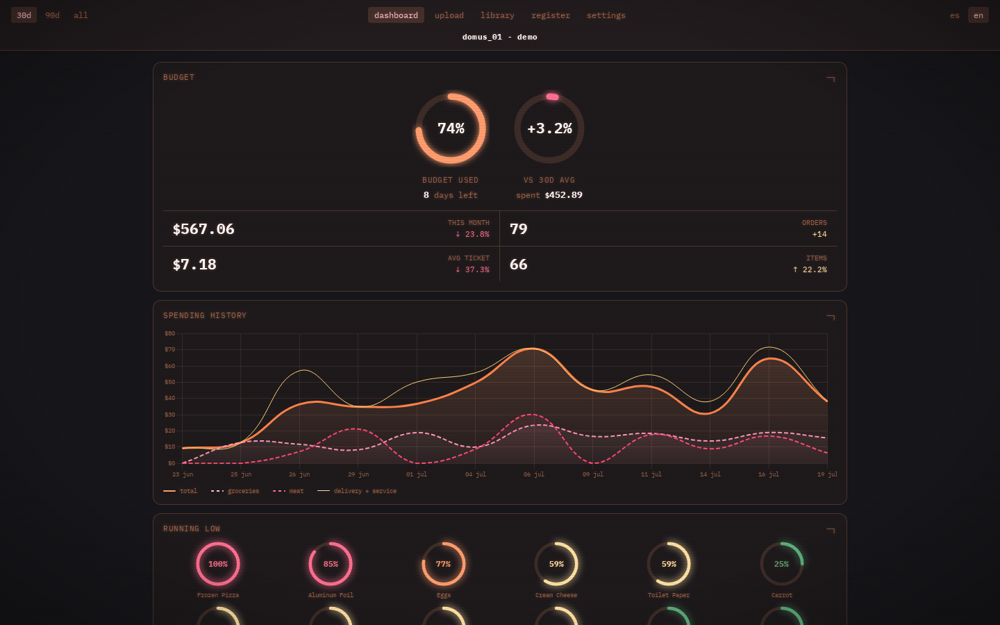
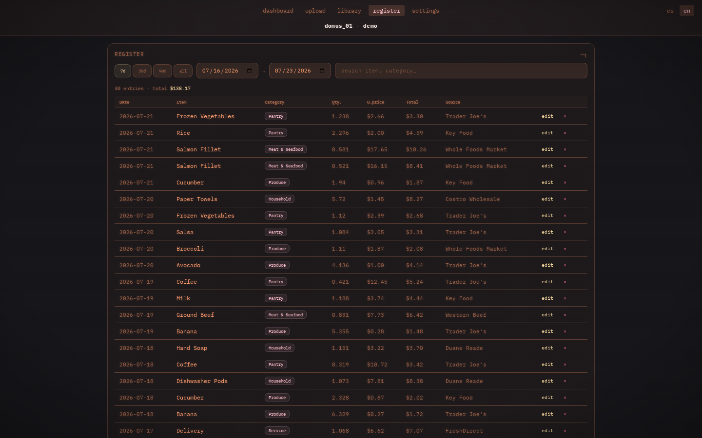
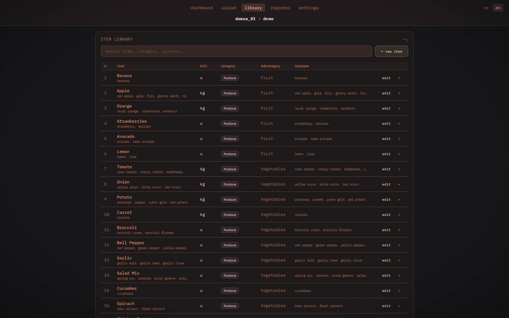

# res_domus

This project started as a warehouse inventory manager. It grew into a home
grocery tracker.

The app reads photos of grocery receipts. It uses computer vision to find
the items, prices, and categories on each receipt. It checks each price
against your own purchase history, so it can flag an unusual price. It
estimates how many days of stock you have left, based on how often you
buy each item. It also includes a chat assistant. The assistant answers
questions such as "What did I spend the most on last month?" by writing
its own database query. It cannot read the part of the database that
stores your API key.

This is more system than a grocery list needs. The project was fun to
build.



## What it does

- **Receipt parsing**: Upload a photo. Claude Sonnet reads the items,
  prices, quantities, and categories into an editable table.
- **Dashboard**: Shows spending trends by category, a monthly budget
  tracker, price history per item, and alerts for unusual prices.
- **Stock estimates**: Flags items you are likely running low on, based
  on how often you buy them.
- **The warehouse manager**: A chat assistant that writes its own
  database queries and summarizes the answer, in English or Spanish. The
  assistant can query only an approved list of tables and views. Each
  query runs on a read-only database connection, so a bad query cannot
  change your data.
- **Installable app**: Add it to your home screen on desktop or mobile
  for an app-like experience.
- **Bilingual interface**: English and Spanish, with a dark "phosphor
  terminal" theme.

The app runs **locally**. Your data stays in a SQLite database on your
machine. The AI features (receipt parsing and the warehouse manager) are
**optional**. They activate only when you add your own Anthropic API key.

<p float="left">
  
  
</p>

## Quick start (Docker)

This method needs [Docker](https://www.docker.com/). Use Docker Desktop
on Mac or Windows. Use `docker` and `docker compose` on Linux.

1. Clone the repository and copy the config template:

   ```bash
   git clone https://github.com/aitor1717/res_domus.git
   cd res_domus
   cp app/config.example.py app/config.py
   ```

2. Set up your data. Choose one option:

   **Option A: Use sample data.** This creates about 14 months of
   synthetic purchase history, so the dashboard and charts have data to
   show right away.

   ```bash
   python3 app/scripts/seed_demo_data.py
   cp data/res_domus_demo.db data/res_domus.db
   ```

   **Option B: Start with an empty database.**

   ```bash
   python3 app/scripts/init_db.py
   ```

3. Start the app:

   ```bash
   docker compose up --build
   ```

4. Open `http://localhost:5000` in your browser.

The `data/` directory holds your database, receipt uploads, and review
queue. Docker mounts this directory from your machine, so your data
survives a rebuild.

### Without Docker

```bash
cd app
pip install -r requirements.txt
flask --app app run --debug
```

## Enabling AI features (optional)

Receipt parsing and the warehouse manager need an
[Anthropic API key](https://console.anthropic.com/). Without a key, the
app shows a "not configured" message for these two features. Every other
feature works without a key, including the dashboard, manual entry, the
item library, and the budget tracker.

Add a key one of two ways:

- Open **Settings → AI Manager** in the app and paste your key. The app
  stores the key in the local database. It never sends the key anywhere
  else.
- Set the `ANTHROPIC_API_KEY` environment variable before you start the
  app. For example, add it to a `.env` file next to `docker-compose.yml`.

## Install as an app (PWA)

- **Desktop (Chrome or Edge)**: Click the install icon in the address
  bar.
- **Mobile (iOS Safari or Android Chrome)**: Open the site. Choose "Add
  to Home Screen" from the share menu. The app then opens full-screen
  with its own icon.

This works on `localhost`, your LAN IP, or a domain if you deploy the app
(see below).

## Troubleshooting

- **Error: "config.py not found" on startup.** Copy the template:
  `cp app/config.example.py app/config.py`. Set `ANTHROPIC_API_KEY`, or
  leave it blank to run without AI features.
- **The dashboard is empty, or shows "no purchases" everywhere.** Your
  `data/res_domus.db` file is missing, or has no `purchases` table. Run
  `python3 app/scripts/init_db.py` for an empty database. Or run
  `python3 app/scripts/seed_demo_data.py`, then copy
  `data/res_domus_demo.db` to `data/res_domus.db` for sample data. The
  app logs a warning on startup when this table is missing.
- **The AI banner says "not configured," and upload/chat look disabled.**
  Add an Anthropic API key in **Settings → AI Manager**. Or set the
  `ANTHROPIC_API_KEY` environment variable and restart the app.
- **The server returns an error (HTTP 500).** Check `docker compose
  logs`, or check stdout in local development. The server logs the full
  error even though the API response is a short message.

## Security and privacy

- Set `BASIC_AUTH_USER` and `BASIC_AUTH_PASS` before you expose this app
  beyond `localhost`. Set these as environment variables, or in
  `config.py`. They add an HTTP Basic Auth check to every request. Leave
  both blank for local-only use.
- `app/config.py` and the whole `data/` directory are gitignored. This
  includes your database, receipts, and stored API key. Your purchase
  history and secrets never enter the git history.
- The warehouse manager checks each generated query against a fixed list
  of allowed tables and views. This list excludes the table that stores
  your API key. Each query also runs on a read-only connection. These are
  two separate safety checks. A failure in one check does not defeat the
  other.

## Tech stack

Flask, SQLite, the Anthropic API (Claude Sonnet), Chart.js 4, vanilla
JavaScript, Docker.

## Project layout

```
app/               Flask app
  app.py             App factory, page routes, Basic Auth gate
  api/               Blueprints: dashboard, upload, chat, items, settings
  parser/            Receipt parsing (Claude) + DB import + SQL views
  templates/, static/  Frontend (Jinja + vanilla JS + Chart.js)
  scripts/           Demo data generator, empty-DB initializer
data/              Gitignored runtime data: res_domus.db, input/, review/,
                   archive/, output/
docs/              GitHub Pages showcase (not part of the running app)
```

## Advanced: deploying to a server

To reach your instance from outside your home network, for example from
your phone, see [DEPLOY.md](DEPLOY.md). It covers a Docker and Caddy
setup with automatic HTTPS, on a free-tier VPS.
