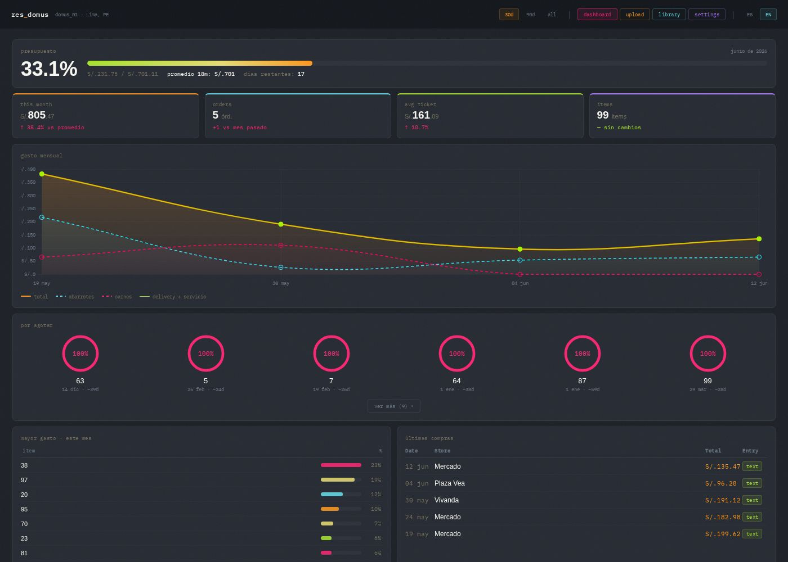

# res_domus

A self-hosted household grocery tracker. Snap photos of receipts, let Claude
parse them into structured line items, review/edit the results, and get a
live dashboard of spending trends, inventory estimates, price history, and
price-anomaly alerts — plus a natural-language chat assistant for querying
your own data.



Live showcase: [docs/index.html](docs/index.html) (GitHub Pages) · [audit report (8.5/10)](docs/audit-1-report.html)

## Features

- **Receipt parsing** — upload photos, Claude Sonnet extracts items, prices,
  quantities, and categories into an editable review table.
- **Dashboard** — spending trends by category, monthly budget tracking,
  price history per item, and z-score anomaly alerts for unusual prices.
- **Inventory estimates** — based on purchase frequency, flags items you're
  likely running low on.
- **Chat manager** — ask questions about your spending in plain language
  (English or Spanish); Claude writes the SQL and summarizes the answer.
- **Installable PWA** — "Add to Home Screen" on desktop or mobile for an
  app-like experience.
- **Bilingual UI** (ES/EN), dark theme.

All of this runs **locally** against a SQLite database that never leaves
your machine. The AI features (receipt parsing + chat) are **optional** and
only activate once you add your own Anthropic API key.

## Quick start (Docker)

Requires [Docker](https://www.docker.com/) (Docker Desktop on Mac/Windows,
`docker` + `docker compose` on Linux).

```bash
git clone https://github.com/aitor1717/res_domus.git
cd res_domus
cp app/config.example.py app/config.py
```

**Try it with demo data** (generates ~14 months of fake grocery purchases so
the dashboard, charts, and anomaly detection have something to show):

```bash
python3 app/scripts/seed_demo_data.py
cp data/res_domus_demo.db data/res_domus.db
```

**Or start empty** with your own data:

```bash
python3 app/scripts/init_db.py
```

Then:

```bash
docker compose up --build
```

Open http://localhost:5000 — that's it. The whole `data/` directory (DB,
uploads, review queue, archive, output) is bind-mounted, so your data
persists across rebuilds and lives entirely on your machine.

### Without Docker

```bash
cd app
pip install -r requirements.txt
flask --app app run --debug
```

## Enabling AI features (optional)

Receipt parsing and the chat manager need an
[Anthropic API key](https://console.anthropic.com/). Without one, those
features show a friendly "not configured" message — everything else
(dashboard, manual entry, items library, budget) works fine.

To activate them, either:

- Go to **Settings → AI Manager** in the app and paste your key (stored in
  the local database, never sent anywhere else), or
- Set the `ANTHROPIC_API_KEY` environment variable before starting the app
  (e.g. in a `.env` file alongside `docker-compose.yml`).

## Install as an app (PWA)

- **Desktop (Chrome/Edge)**: click the install icon in the address bar.
- **Mobile (iOS Safari / Android Chrome)**: open the site, then "Add to Home
  Screen" from the share/menu. It launches full-screen with its own icon.

This works against `localhost`, your LAN IP, or a domain if you deploy it
(see below).

## Troubleshooting

- **"config.py not found" error on startup** — copy the template:
  `cp app/config.example.py app/config.py`, then set `ANTHROPIC_API_KEY` (or
  leave it blank to run without AI features).
- **Dashboard is empty / "no purchases" everywhere** — `data/res_domus.db` is
  missing or has no `purchases` table yet. Run `python3 app/scripts/init_db.py`
  for an empty DB, or `python3 app/scripts/seed_demo_data.py` + copy
  `data/res_domus_demo.db` → `data/res_domus.db` for sample data. The app
  logs a warning on startup if this table is missing.
- **AI banner says "not configured" / upload and chat are greyed out** — add
  an Anthropic API key in **Settings → AI Manager**, or set the
  `ANTHROPIC_API_KEY` environment variable and restart.
- **Server errors (500)** — check `docker compose logs` (or stdout in local
  dev); tracebacks are logged server-side even though the API returns a
  short JSON error message.

## Security & privacy

- Set `BASIC_AUTH_USER` / `BASIC_AUTH_PASS` (env vars or `config.py`) before
  exposing this beyond `localhost` — it gates every request with HTTP Basic
  Auth. Leave both blank for local-only use.
- `app/config.py` and the whole `data/` directory (DB, receipts, API key
  storage) are gitignored — your purchase history and secrets never get
  committed.

## Tech stack

Flask · SQLite · Anthropic API (Claude Sonnet) · Chart.js 4 · vanilla JS ·
Docker

## Project layout

```
app/               Flask app
  app.py             App factory, page routes, Basic Auth gate
  api/               Blueprints: dashboard, upload, chat, items, settings
  parser/            Receipt parsing (Claude) + DB import + SQL views
  templates/, static/  Frontend (Jinja + vanilla JS + Chart.js)
  scripts/           Demo data generator, empty-DB initializer
data/              Gitignored runtime data: res_domus.db, input/, review/,
                   archive/, output/
docs/              GitHub Pages showcase (not part of the running app)
archive/           Superseded code/designs kept for reference
```

See [CLAUDE.md](CLAUDE.md) for full architecture notes.

## Advanced: deploying to a server

If you want your own instance reachable from outside your home network
(e.g. to use it from your phone away from home), see
[DEPLOY.md](DEPLOY.md) for a Docker + Caddy + automatic-HTTPS setup on a
free-tier VPS.
